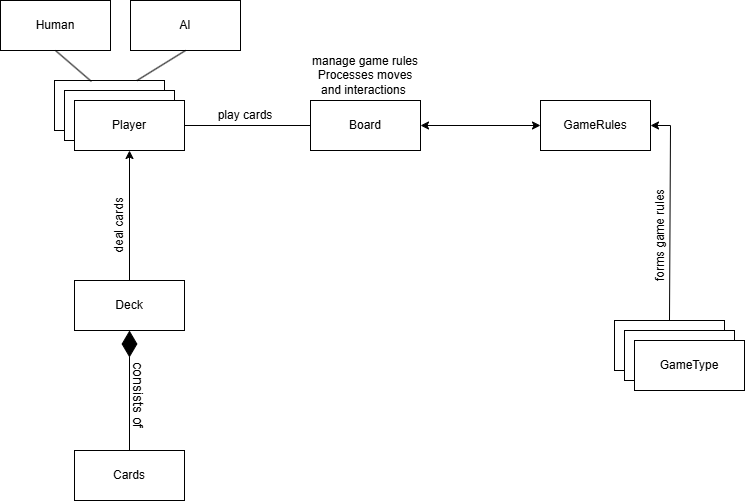
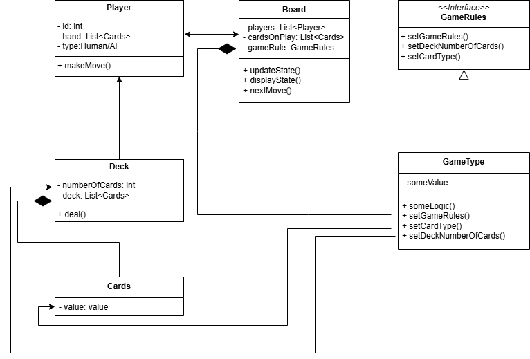

Object-Oriented Thinking assigment

Card Games simulator

Functional Requirements:  
1.Support common card games (Poker, Uno, Solitaire, BlackJack).  
2.Players should be able to interact with the game board/cards.  
3.Card shuffling, deck management and rules for each supported game must be enforced automatically.  
4.Multiple players can join and play a game.  
5.AI players with different difficulty.  

Non-Functional Requirements:  

1.The system should find and load games within 20 seconds at most.  
2.Game updates (e.g., moves, shuffles) should process in 1 second.  
3.Support up to 8 concurrent players for online multiplayer.  
4.Allow a growing library of games to be added without major architectural changes.  
5.No loss of game state due to crashes or disconnections.  
6.Support multiple devices, such as desktop, tablets, and smartphones.  
7.Provide offline modes for single-player games.  
8.Support multiple languages(English, Ukrainian).  
9.Availible 24/7  

Use Case 1

Title: Play an online game  
Primary actor: Player  
Secondary actor: Simulator  
Success scenario:  
1.Player choosing a game type(Poker, Uno, Solitaire, Blackjack).  
2.Simulator connects Player with other players in queue.  
3.a.If there is not enough players for choosed game type in queue and queue time is over 20s, Simulator adds an AI players  
4.Simulator set rules based on choosed game type, shuffles and deals cards.  
5.Player interacts with cards based on rules until game ends.  
6.Simulator announces the winner.  
	
Use Case 2

Title: Play an offline game  
Primary actor: Player  
Secondary actor: Simulator  
Success scenario:  
1.Player is launching the simulator.  
2.Player choosing a game type(Poker, Uno, Solitaire, Blackjack).  
3.Player choosing difficulty of an AI opponent.  
4.Simulator set rules based on choosed game type, shuffles and deals cards.  
5.Player interacts with cards based on rules until game ends.  
6.Simulator announces the winner.  

Objects and relationships in the system

Class diagrams

